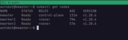

# Skoupidia

Your home machine learning cluster made from rubbish and things found 'round the house.





## Create A Kubernetes Cluster

### Create Autobot User

On each of the servers, create a user named `autobot`. This will be the user ansible will use to install and remove software:

```bash
sudo adduser autobot
sudo usermod -aG sudo autobot
```

Autobot has now been added to the sudo group, but to make ansible less of a pain, remove the need to interactively type the password every time autobot changes to run a command as root.

```bash
sudo su
echo "autobot ALL=(ALL) NOPASSWD:ALL" >> /etc/sudoers.d/peeps
```

#### Generate an SSH key locally

You can do this a number of ways, but here is an easy version:

```bash
ssh-keygen -f ~/.ssh/home-key -t rsa -b 4096
```

or you can use the premade task

```bash
make ssh_keys
```

This will, by default save the public and private keys into your `~/.ssh` directory.

We want to take the `.pub` (public) key from our local server, and add the contents of the pub key to the file `~/.ssh/authorized_keys` on each of the servers in the `autobot` users home directory.

This will allow your local machine (or any machine that has the private key) to be able to automatically login to any of the nodes without typing a password. Again this will be very helpful when running the ansible scripts.

One way to do this is to copy the file contents to the clipboard:

```bash
xclip -selection clipboard < ~/.ssh/home-key.pub
```

Then ssh into the machine as user `autobot`, and paste the clipboard contents into the `~/.ssh/authorized_keys` file (or create the file if it doesn't already exist).

### Run Ansible Setups

We should now be ready to run the [anisble](./ansible/README.md) code.

The Anisble scripts will install some prerequisites, docker, and kubeadm and kubectl on the master and the worker nodes.

Follow along with the [README in the ansible directory](./ansible/README.md) to continue.

### Few Difficult to Script Tasks

Now that ansible had run completely, we need to do a few manual steps. Don't skip these!

You'll need to run these commands on all the nodes (master and workers). After ansible has finished without error.

```bash
sudo su
systemctl stop containerd
rm /etc/containerd/config.toml
# it's ok if that errors --^
containerd config default > /etc/containerd/config.toml
```

You'll need to use a text editor and set a value from `false` to `true`. 

Edit the file `/etc/containerd/config.toml`, and change the setting `SystemdCgroup = false` to `SystemdCgroup = true` in the section:

```toml
...
[plugins."io.containerd.grpc.v1.cri".containerd.runtimes.runc.options]
    ...
    SystemdCgroup = true
...
```

This will enable the systemd cgroup driver for the containerd container runtime.

```bash
systemctl restart containerd
```

Run the following to pull down needed configurations for kubeadm

```bash
kubeadm config images pull
```

### Run Kube Init

Now, only on the designated **master** node, run

```bash
kubeadm init --v=5
```

If all goes well, the output of this command will give use the commands we can use on the worker nodes to join the cluster.

For example:

```bash
kubeadm join 192.168.1.15:6443 --token 3e...l --discovery-token-ca-cert-hash sha256:65...ec 
```

Save copy this command as we'll use this on the worker nodes to have the nodes join the master node.

It's a good idea to add the kube config to the autobot user so you can do things like `kubectl get nodes`. Run these as the autobot user:

```bash
mkdir -p $HOME/.kube
sudo cp -i /etc/kubernetes/admin.conf $HOME/.kube/config
sudo chown $(id -u):$(id -g) $HOME/.kube/config
```

### Join Workers to Cluster

On each worker nodes run the join command (note your values will be slightly different)

```bash
kubeadm join 192.168.1.15:6443 --token 3eown3.mqv6a0p2pz3vd6il \
        --discovery-token-ca-cert-hash sha256:926d39ea23aab584720dd3cf846124dc4b08bddd2021b18252a8e7e9dee765ec
```

### Cluster Networking Using Calico

After the workers have joined the cluster, we should be able to see them:

```
autobot@kmaster:~$ kubectl get nodes
NAME       STATUS     ROLES           AGE     VERSION
kmaster    NotReady   control-plane   77m     v1.28.6
kworker1   NotReady   <none>          25m     v1.28.6
kworker2   NotReady   <none>          3m34s   v1.28.6
```

But we need to add container networking before they will be in the ready state

```bash
kubectl apply -f https://raw.githubusercontent.com/projectcalico/calico/v3.26.1/manifests/calico.yaml
```

After applying calico, give the cluster some time to get all the node into the ready state.

```
autobot@kmaster:~$ kubectl get nodes -w
NAME       STATUS   ROLES           AGE   VERSION
kmaster    Ready    control-plane   91m   v1.28.6
kworker1   Ready    <none>          40m   v1.28.6
kworker2   Ready    <none>          17m   v1.28.6
```

We now have a working cluster!

## Install Kubeflow

...

## References

- [Build a Kubernetes Home Lab from Scratch step-by-step!](https://www.youtube.com/watch?v=_WW16Sp8-Jw)
- [How to Install Containerd Container Runtime on Ubuntu 22.04](https://www.howtoforge.com/how-to-install-containerd-container-runtime-on-ubuntu-22-04/)
- [How to with new stuff](https://v1-28.docs.kubernetes.io/docs/setup/production-environment/tools/kubeadm/install-kubeadm/)


